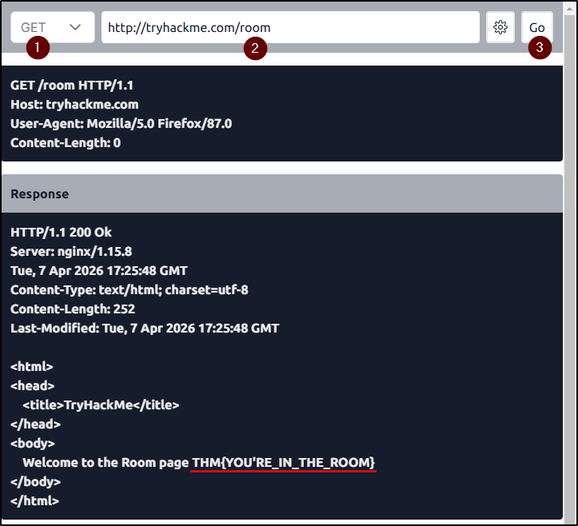
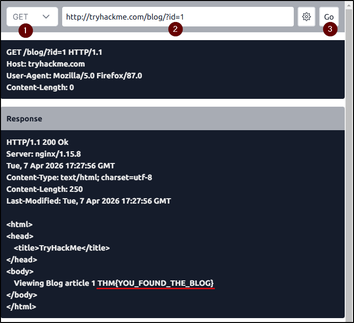
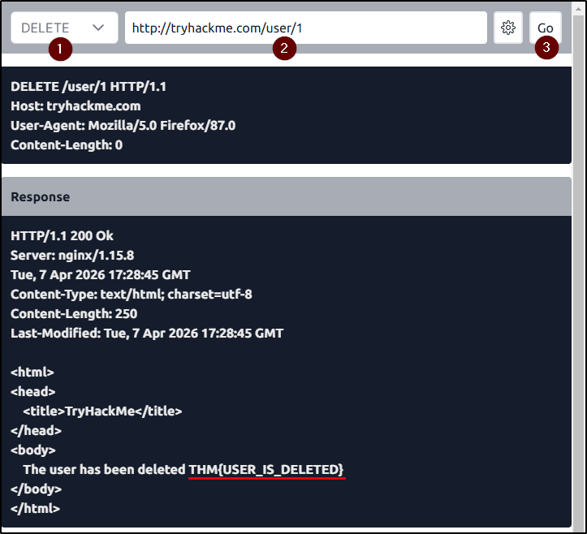
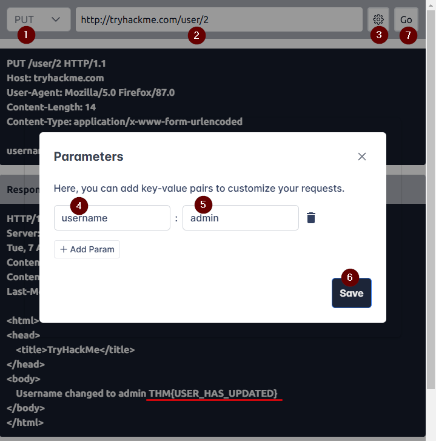

##### Link: [HTTP in Detail](https://tryhackme.com/room/httpindetail)
---
##### Task 1: What is HTTP(S)?
1. What does HTTP stand for?
	- `HyperText Transfer Protocol`
2. What does the S in HTTPS stand for?
	- `secure`
3. On the mock webpage on the right there is an issue, once you've found it, click on it. What is the challenge flag?
	- Notice unlocked lock icon that indicates the connection is unsecure
		- 
	- Click on it and the flag will appear
	- Flag: `THM{INVALID_HTTP_CERT}`
---
##### Task 2: Requests And Responses
1. What HTTP protocol is being used in the above example?
	- `HTTP/1.1`
2. What response header tells the browser how much data to expect?
	- `Content-Length`
---
##### Task 3: HTTP Methods
1. What method would be used to create a new user account?
	- `POST`
2. What method would be used to update your email address?
	- `PUT`
3. What method would be used to remove a picture you've uploaded to your account?
	- `DELETE`
4. What method would be used to view a news article?
	- `GET`
---
##### Task 4: HTTP Status Codes
1. What response code might you receive if you've created a new user or blog post article?
	- `201`
2. What response code might you receive if you've tried to access a page that doesn't exist?
	- `404`
3. What response code might you receive if the web server cannot access its database and the application crashes?
	- `503`
4. What response code might you receive if you try to edit your profile without logging in first?
	- `401`
---
##### Task 5: Headers
1. What header tells the web server what browser is being used?
	- `User-Agent`
2. What header tells the browser what type of data is being returned?
	- `Content-Type`
3. What header tells the web server which website is being requested?
	- `Host`
---
##### Task 6: Cookies
1. Which header is used to save cookies to your computer?
	- `Set-Cookie`
---
##### Task 7: Making Requests
1. Make a `GET` request to `/room` page
	- 
	- Flag: `THM{YOU'RE_IN_THE_ROOM}`
2. Make a `GET` request to `/blog` page and set the id parameter to `1`. Note: Use the gear button on the right to manage URI parameters
	- 
	- Flag: `THM{YOU_FOUND_THE_BLOG}`
3. Make a `DELETE` request to `/user/1` page
	- 
	- Flag: `THM{USER_IS_DELETED}`
4. Make a `PUT` request to `/user/2` page with the `username` parameter set to `admin`
	- 
	- Flag: `THM{USER_HAS_UPDATED}`
5. Make a `POST` request to `/login` page with the `username` of `thm` and a `password` of `letmein`
	- 
	- Flag: `THM{HTTP_REQUEST_MASTER}`
---
