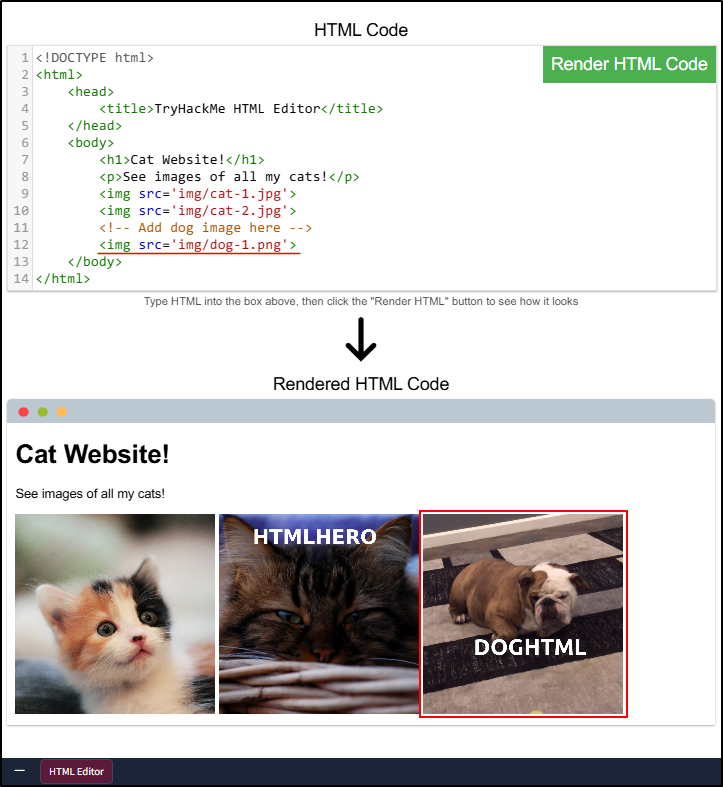
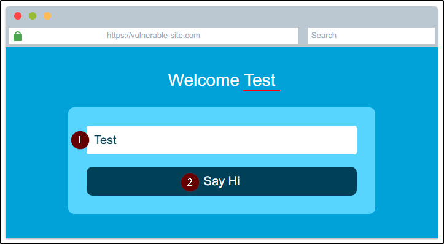
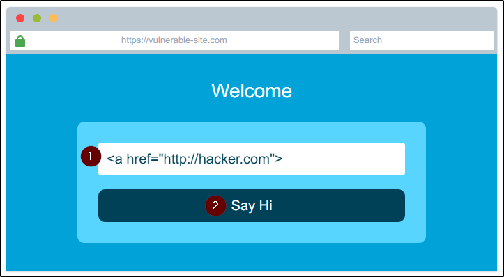

##### Link: [How Websites Work](https://tryhackme.com/room/howwebsiteswork)
---
##### Task 1: How websites work
1. What term best describes the component of a web application rendered by your browser?
	- `Front End`
---
##### Task 2: HTML
1. Let's play with some HTML! First click the "`View Site`" button inside this task. 
	- On the right-hand side, you should see a box that renders HTML - If you enter some HTML into the box and click the green "Render HTML Code" button, it will render your HTML on the page; you should see an image of some cats.
	- No answer needed
2. One of the images on the cat website is broken - fix it, and the image will reveal the hidden text answer!
	- Edit line 10: `` then click `Render HTML Code`
		- 
	- Flag: `HTMLHERO`
3. Add a dog image to the page by adding another `img tag ()` on line 11. The dog image location is `img/dog-1.png`. What is the text in the dog image?
	- Add on line 12: ``  then click `Render HTML Code`
		- 
	- Flag: `DOGHTML`
---
##### Task 3: JavaScript
1. Click the "View Site" button on this task. On the right-hand side, add JavaScript that changes the demo element's content to "Hack the Planet"
	- Add line 10: `document.getElementById("demo").innerHTML = "Hack the Planet";` then click `Render`
		- 
	- Flag: `JSISFUN`
2. Add the button HTML from this task that changes the element's text to "Button Clicked" on the editor on the right, update the code by clicking the "Render HTML+JS Code" button and then click the button.
	- Add line 8: `<button onclick='document.getElementById("demo").innerHTML = "Button Clicked";'>Click Me!</button>` then click `Render`
		- 
	- When the button clicked, the text will change
		- 
	- `No answer needed`
---
##### Task 4: Sensitive Data Exposure
1. View the website on this link (opens in new tab). What is the password hidden in the source code?
	- Open link: `https://static-labs.tryhackme.cloud/sites/howwebsiteswork/html_data_exposure/`, we see login form
		- 
	- Right click → `View page source`
		- 
	- We find the hidden password
		- 
	- Answer: `testpasswd`
---
##### Task 5: HTML Injection
1. View the website on this task and inject HTML so that a malicious link to `http://hacker.com` is shown.
	- Open website, we find text input with button that when clicked, reflect our input
		- 
		- 
	- Enter link to malicious site then click the button: `<a href="http://hacker.com">`
		- 
	- Note: Sometimes the website is buggy and input is not rendered. Simply refresh the page to solve this
	- Flag: `HTML_INJ3CTI0N`
---
