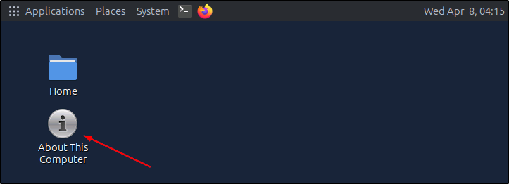
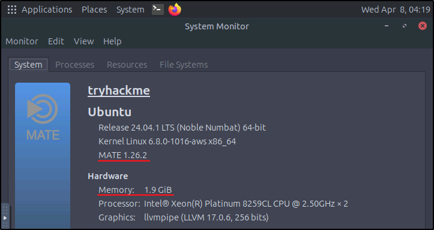
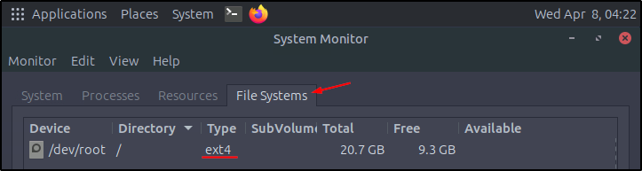
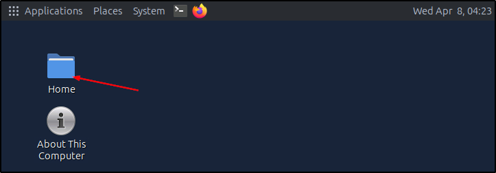
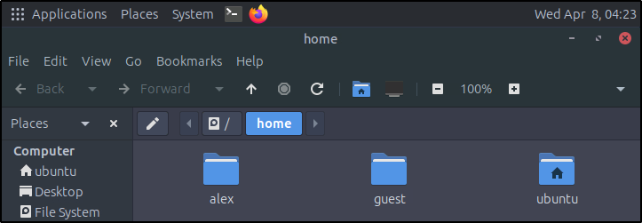
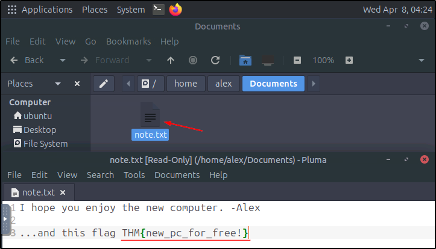

##### Link: [Operating Systems: Introduction](https://tryhackme.com/room/operatingsystemsintroduction)
---
##### Task 1: Introduction
1. I understand the learning objectives and am ready to learn about operating systems!
	- `No answer needed`
---
##### Task 2: The Invisible Manager
1. Which OS space has unrestricted access to your computer's hardware?
	- `Kernel Space`
2. Which OS responsibility manages user accounts, authentication, and permissions?
	- `User Management`
3. After opening the `About This Computer` shortcut, you are greeted with an overview of the system's specifications.. What version of Ubuntu Mate is your computer running?
	- Open target, click `About This Computer`
		- 
		- 
	- `1.26.2`
4. Check out the Hardware section of the System tab.. How much memory is allocated to your machine?
	- `1.9 GiB`

---
##### Task 3: OS Interaction and Landscape
1. Open the `File Systems` tab in `System Monitor`. What `Type` is listed for the `/dev/root` device?
	- From previous exercise. move to `File Systems` tab
		- 
	- `ext4`
2. After opening the `Home` directory on the Desktop, how many user directories exist?
	- Click icon on Desktop
		- 
		- 
	- Answer: `3`
3. Navigate to Alex's home directory and explore the `Documents` folder. What is the flag value contained in `note.txt`?
	- Go to `/home/alex/Documents`, open the file
		- 
	- Flag: `THM{new_pc_for_free!}`
---
##### Task 4: Conclusion
1. Complete the room and continue on your cyber learning journey!
	- `No answer needed`
---
