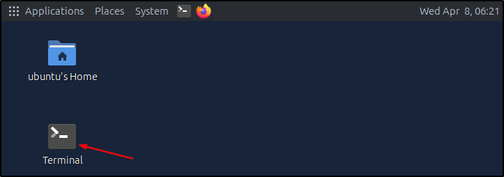
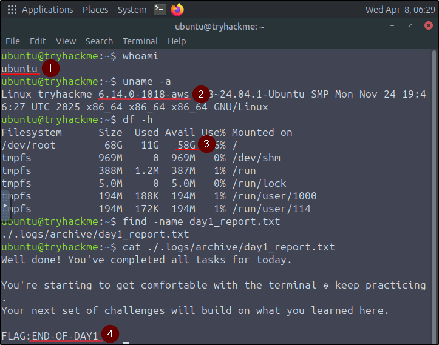

##### Link: [Linux CLI Basics](https://tryhackme.com/room/linuxclibasics)
---
##### Task 1: Introduction
1. What does "CLI" stand for?
	- `command-line interface`
---
##### Task 2: Navigation Mission: "Find the Missing Notes"
1. What is the full path of the `mission_brief.txt` file found on the system using the find command?
	- Open terminal, run `find -name mission_brief.txt`
		- 
		- 
	- `/home/ubuntu/Documents/.research/archive/mission_brief.txt`
2. What is the flag hidden inside the `mission_brief.txt` file?
	- `cat /home/ubuntu/Documents/.research/archive/mission_brief.txt`
	- `MISSION-FOUND`
---
##### Task 3: Investigating the System
1. What is the username returned by the `whoami` command?
	- Image for all questions in this task:
		- 
	- `ubuntu`
2. What is the kernel version shown by `uname -a`?
	- `6.14.0-1018-aws`
3. How much free disk space does `df -h` report?
	- `58G`
4. What is the message written inside `day1_report.txt`?
	- `find -name day1_report.txt`
	- `cat ./.logs/archive/day1_report.txt`
	- `END-OF-DAY1`
---
##### Task 4: Conclusion
1. Continue to complete the room.
	- `No answer needed`
---
