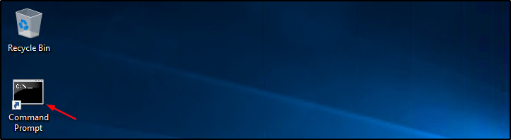
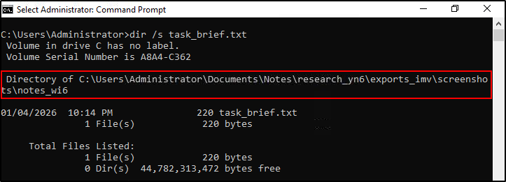
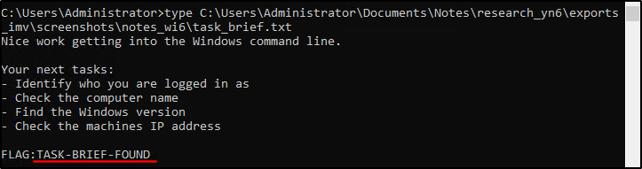
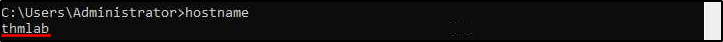
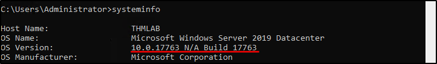

##### Link: [Windows CLI Basics](https://tryhackme.com/room/windowsclibasics)
---
##### Task 1: Introduction
1. Continue to the next task.
	- `No answer needed`
---
##### Task 2: Introduction
1. What is the full path of the task_brief.txt found on the system?
	- Open `cmd`, run `dir /s task_brief.txt`
		- 
		- 
		- 
	- `C:\Users\Administrator\Documents\Notes\research_yn6\exports_imv\screenshots\notes_wi6`
2. What message and flag are written inside task_brief.txt?
	- Use `type C:\Users\Administrator\Documents\Notes\research_yn6\exports_imv\screenshots\notes_wi6\task_brief.txt`
		- ``
	- `TASK-BRIEF-FOUND`
---
##### Task 3: Gathering System Information on Windows
1. What is the computer name shown by `hostname`?
	- Run `hostname`
		- 
	- `thmlab`
2. What Windows version is listed in the `systeminfo` output?
	- Run `systeminfo`
		- 
	- `10.0.17763 N/A Build 17763`
---
##### Task 4: Conclusion
1. Continue to complete the room.
	- `No answer needed`
---
