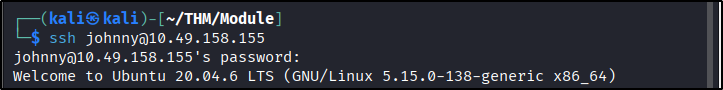
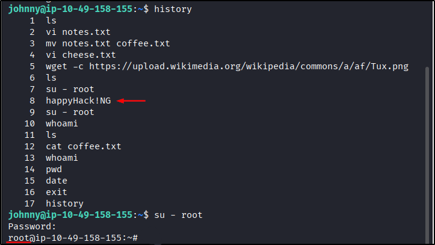
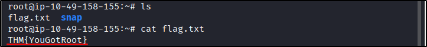

##### Link: [Operating System Security](https://tryhackme.com/room/operatingsystemsecurity)
---
##### Task 1: Introduction to Operating System Security
1. Which of the following is not an operating system?
	- `Thunderbird`
---
##### Task 2: Common Examples of OS Security
1. Which of the following is a strong password, in your opinion?
	- `LearnM00r`
---
##### Task 3: Practical Example of OS Security
1. Based on the top 7 passwords, let’s try to find Johnny’s password. What is the password for the user `johnny`?
	- From `attackbox` or `kali` run `ssh johnny@targetIP` then try top 7 passwords
		- 
	- We manage to login using password `abc123` 
	- Answer: `abc123`
2. Once you are logged in as `Johnny`, use the command `history` to check the commands that Johnny has typed. We expect Johnny to have mistakenly typed the `root` password instead of a command. What is the root password?
	- Run command `history`
		- 
	- Among the output `happyHack!NG` looks suspicious because its not a command and it appear right after attempt to switch user
	- Try it by run `su - root` then enter the password.
	- Its working (indicating by the prompt changed to `root`)
	- Answer: `happyHack!NG`
3. While logged in as Johnny, use the command `su - root` to switch to the `root` account. Display the contents of the file `flag.txt` in the `root` directory. What is the content of the file?
	- Use `ls` to confirm the file exist then read it using `cat flag.txt`
		- 
	- Answer: `THM{YouGotRoot}`
---
