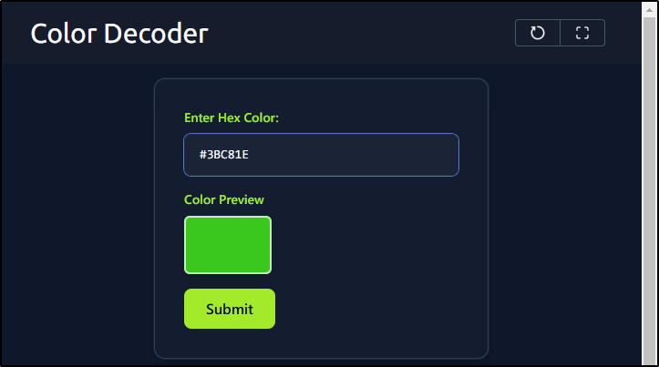
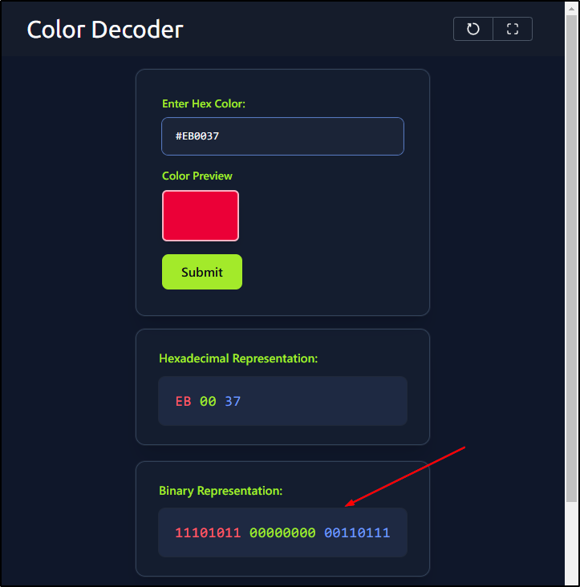
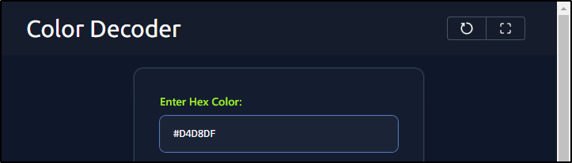
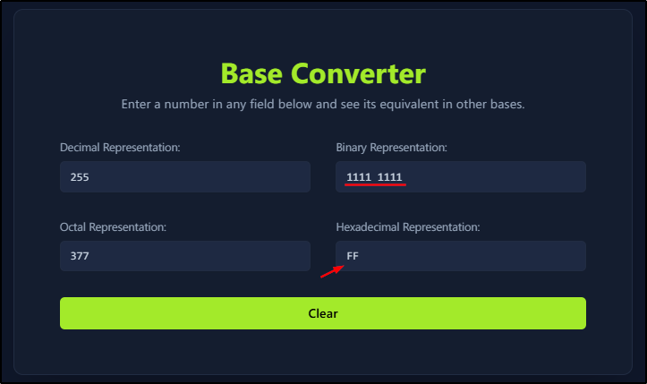
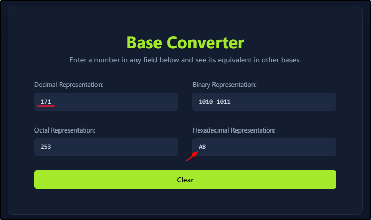
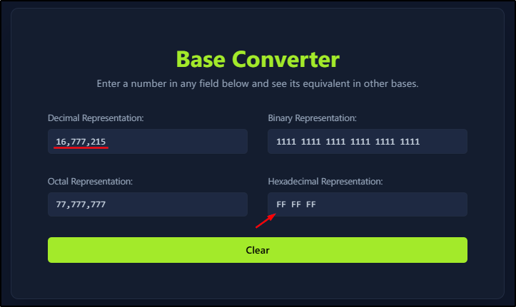

##### [Data Representation](https://tryhackme.com/room/datarepresentation)
---
##### Task 1: Introduction
1. It is time to dive into computer colors!
	- `No answer needed`
---
##### Task 2: Representing Colors
1. Preview the color `#3BC81E`. In one word, what does this color appear to be?
	- 
	- `green`
2. What is the binary representation of the color `#EB0037`?
	- 
	- `11101011 00000000 00110111`
3. What is the decimal representation of the color `#D4D8DF`?
	- 
	- 
	- `212 216 223`
---
##### Task 3: Numbers: From Decimal to Hexadecimal
1. What is the hexadecimal `FF` in binary?
	- 
	- `1111 1111`
2. What is the hexadecimal `AB` in decimal?
	- 
	- `171`
3. Convert the hexadecimal `FF FF FF` to decimal. After you round up the decimal value to the nearest million, how many millions is that?
	- 
	- `16,777,215 -> 17`
	- Answer: `17`
---
##### Task 4: Conclusion
1. It is time to join the Data Encoding room and dive deeper into bits.
	- `No answer needed`
---
