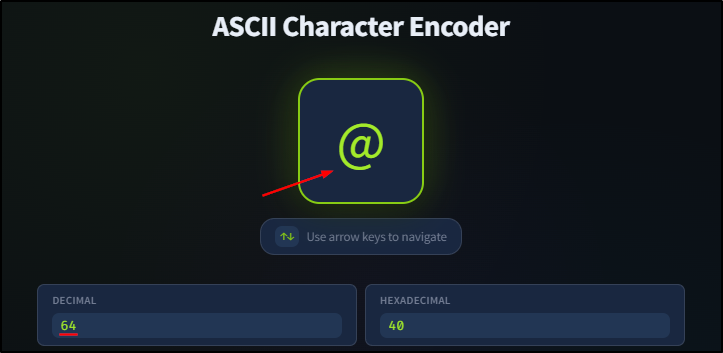
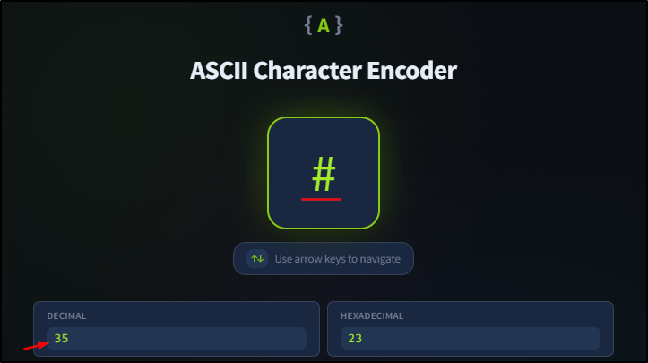
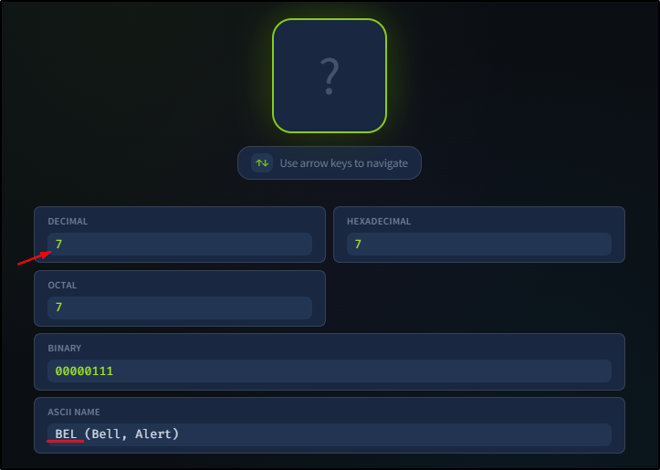
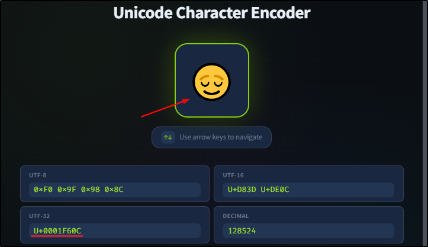
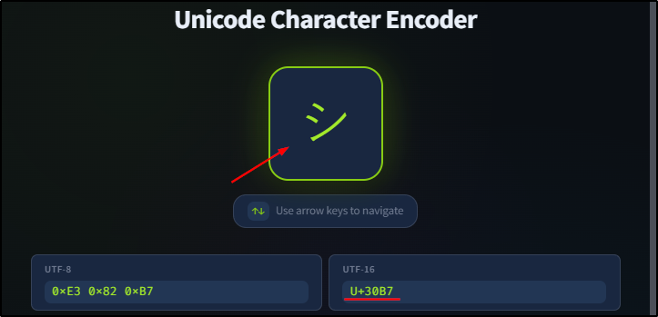
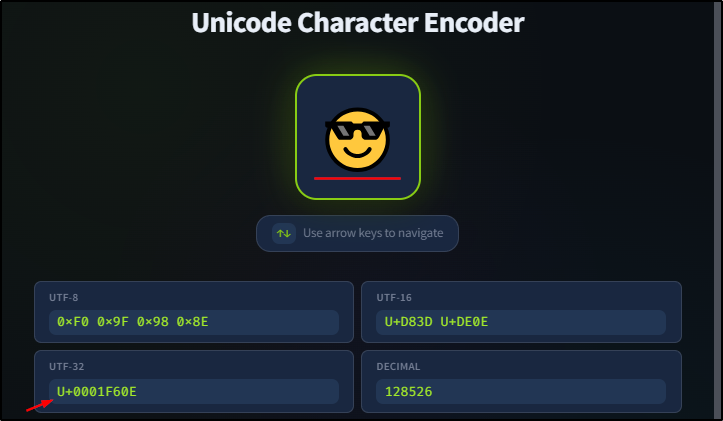
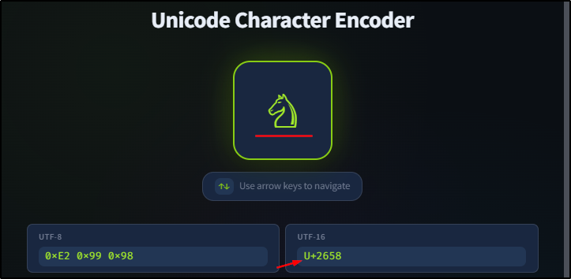

##### Link: [Data Encoding](https://tryhackme.com/room/dataencoding)
---
##### Task 1: Introduction
1. It is time to dive into encoding.
	- `No answer needed`
---
##### Task 2: ASCII
1. What is the ASCII code in decimal for the character `@`?
	- 
	- `64`
2. What is the character that has the ASCII code of 35 in decimal?
	- 
	- `#`
3. What is the name of the character that has the ASCII code of 7?
	- 
	- `BEL`
---
##### Task 3: Unicode
1. What is the UTF-32 encoding of 😌?
	- 
	- `U+0001F60C`
2. What is the UTF-16 encoding of シ? Note that ツ and シ are two different characters.
	- 
	- `U+30B7`
3. What is the character that has the following UTF-32 encoding `U+0001F60E`?
	- 
	- 😎
4. What is the character that has the following UTF-16 encoding `U+2658`?
	- 
	- ♘
---
##### Task 4: Conclusion
1. If you are curious to see how computers manipulate data, join the Python Demo room (coming soon).
	- `No answer needed`
---
