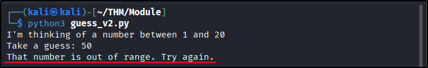

##### Link: [Python: Simple Demo](https://tryhackme.com/room/pythonsimpledemo
---
##### Task 1: Introduction
1. Let’s code our game!
	- `No answer needed`
---
##### Task 2: Introduction
1. What is the name of the function we used to display text on the screen?
	- `print()`
2. What is the name of the function that we used to convert user input to an integer?
	- `int()`
---
##### Task 3: Conditional Statements
1. How does Python write “else if”?
	- `elif`
2. What will the program display if the user’s input is 50?
	- 
	- `That number is out of range. Try again.`
---
##### Task 4: Iterations
1. What type of loop does this program use?
	- `while`
2. What will the program display if the user makes the correct guess in 3 tries?
	- `You got it in 3 tries!`
---
##### Task 5: Conclusion
1. I successfully ran my first game created in Python.
	- `No answer needed`
---
 