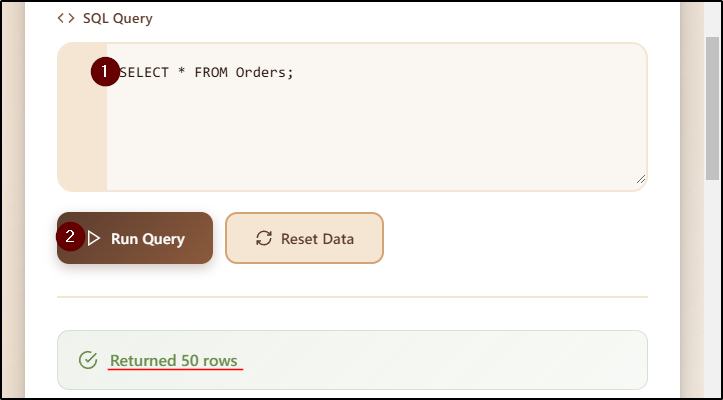
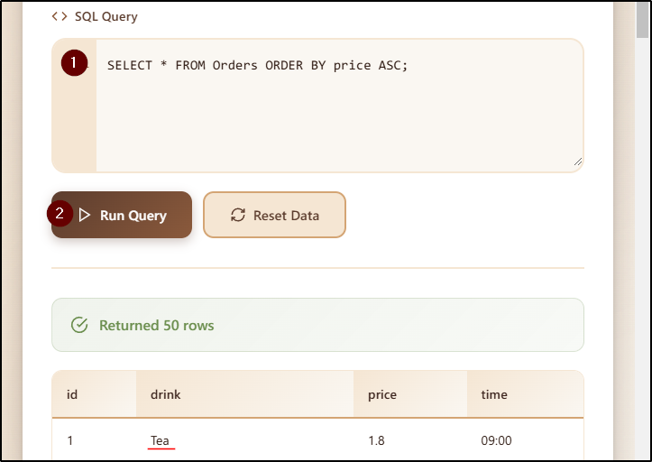

##### Link: [Database SQL Basics](https://tryhackme.com/room/databasesqlbasics)
---
##### Task 1: Introduction
1. I am ready to dive into the database!
	- `No answer needed`
---
##### Task 2: Understanding Tables, Rows, and Columns
1. Inside databases, what is the term for the "spreadsheets" that store the information?
	- `table`
---
##### Task 3: Writing Your First SQL Query
1. When you showed all orders, how many rows were returned?
	- `SELECT * FROM Orders;`
		- 
	- `50`
2. When you sorted orders by price from cheapest to most expensive, which drink appeared first?
	- `SELECT * FROM Orders ORDER BY price ASC;`
		- 
	- `Tea`
3. When you sorted the menu by price from most expensive to cheapest, which drink appeared first?
	- `SELECT * FROM Orders ORDER BY price DESC;`
		- 
	- `Latte`
---
##### Task 4: Conclusion
1. I have successfully completed this room and can write basic SQL queries.
	- `No answer needed`
---
