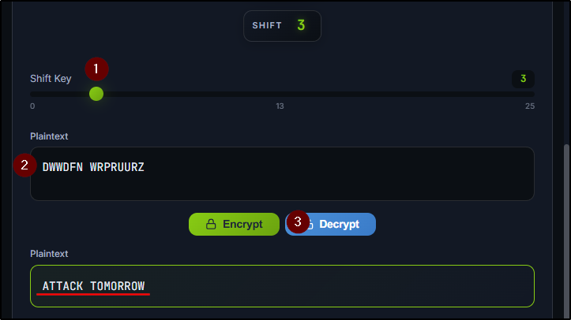
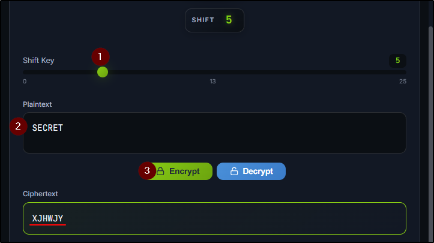
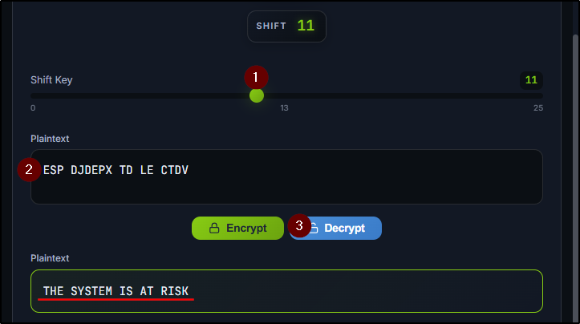
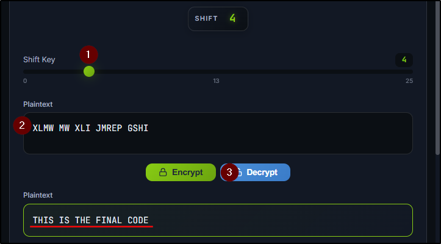
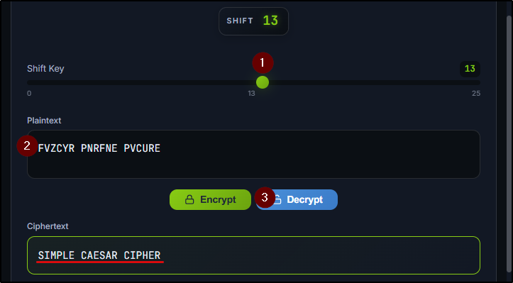

##### Link: [Cryptography Concepts](https://tryhackme.com/room/cryptographyconcepts)
---
##### Task 1: Introduction
1. Let's get started.
	- `No answer needed`
---
##### Task 2: Hiding Information - Symmetric Encryption
1. What's the flag you received after completing all levels of the Secret Message Rescue game?
	1. Decrypt `DWWDFN WRPRUURZ` with shift key 3: 
		- `ATTACK TOMORROW`
			- 
	2. Encrypt `SECRET` with shift key 5: 
		- `XJHWJY`
			- 
	3. Decrypt `XLMW MW XLI JMREP GSHI` by guessing the key
		1. Key: `11`
		2. Decrypted: `THE SYSTEM IS AT RISK`
			- 
	4. Decrypt `ESP DJDEPX TD LE CTDV` by guessing the key
		1. Key: `4`
		2. Decrypted: `THIS IS THE FINAL CODE`
			- 
			- 
	- Flag: `THM{CAESAR_CIPHER_MASTER_2026}`
2. Using the Caesar cipher with a key of 5, what does `CYBER` become when encoded? (Uppercase, no spaces.)
	- Image
		- 
	- `HDGJW`
3. Using the Caesar cipher, find the correct key and decode the following secret message: `FVZCYR PNRFNE PVCURE`.
	- Image:
		- 
	- `SIMPLE CAESAR CIPHER`
---
##### Task 3: Sharing Keys Safely: Asymmetric Encryption
1. In asymmetric encryption, which key stays secret?
	- `private key`
2. With asymmetric encryption, Alice can encrypt a message using Bob's public key, and only Bob's private key can decrypt it. Yay or Nay?
	- `Yay`
3. What problem does asymmetric solve that symmetric cannot?
	- `key distribution`
4. After initial asymmetric exchange in HTTPS, what encryption type handles bulk data?
	- `symmetric`
---
##### Task 4: Conclusion
1. I've completed the room!
	- `No answer needed`
---
