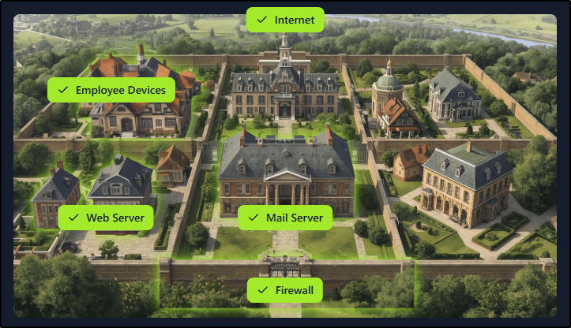
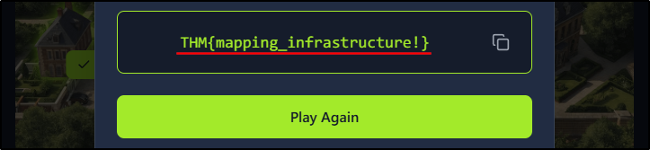
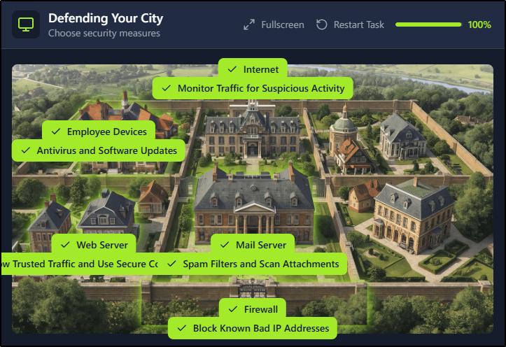
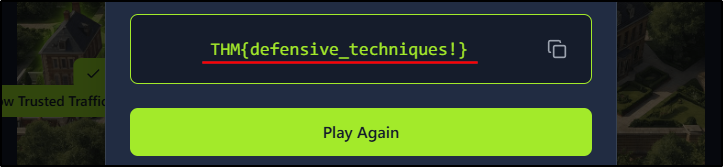

##### Link: [Become a Defender](https://tryhackme.com/room/becomeadefender)
---
##### Task 1: What Is Defensive Security?
1. I understand the learning objectives and am ready to learn about Defensive Security!
	- `No answer needed`
---
##### Task 2: Understanding Your Environment
1. What is the goal when a defender puts security controls in place to stop threats before any damage occurs?
	- `Prevention`
2. What process involves reviewing logs and evidence to understand how an incident happened and what was impacted?
	- `Analysis`
3. What flag did you receive after successfully mapping your city infrastructure?
	- Image:
		- 
		- 
	- `THM{mapping_infrastructure!}`

---
##### Task 3: Defending Your Environment
1. Which defender principle focuses on identifying the most critical systems to guide security efforts and focus?
	- `Risk Prioritization`
2. What flag did you receive after successfully defending your city's infrastructure?
	- Image
		- 
		- 
	- `THM{defensive_techniques!}`
---
##### Task 4: Where to Go From Here
1. Complete the room and continue on your cyber learning journey!
	- `No answer needed`
---
