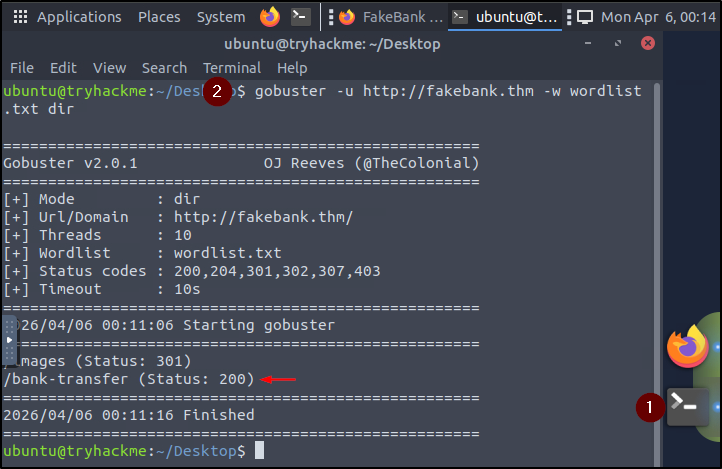
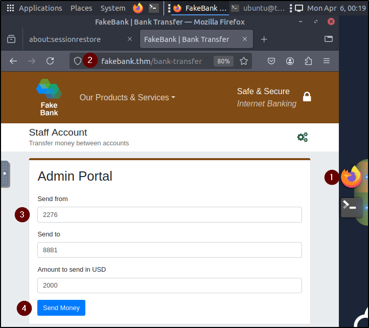
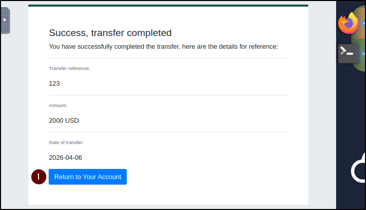
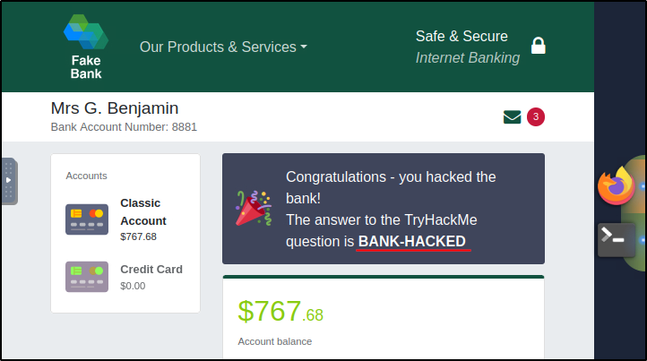

##### Link: [Offensive Security Intro](https://tryhackme.com/room/offensivesecurityintro)
---
##### Task 1: What is Offensive Security?
1. Which of the following options better represents the process where you simulate a hacker's actions to find vulnerabilities in a system?  
	- `Offensive Security`
- ---
##### Task 2: Hacking your first machine
1. Above your account balance, you should now see a message indicating the answer to this question. Can you find the answer you need?
	- Open terminal, run `gobuster` to find hidden pages
		- `gobuster -u http://fakebank.thm -w wordlist.txt dir`
		- `-u`: Target URL, `-w`: Wordlist used
		- 
	- Visit `/bank-transfer` in browser and send the money
		- 
	- After transfer confirmed successful, return to account page to obtain the flag
		- 
		- 
	- ------------
	- Flag: `BANK-HACKED`
---
##### Task 3: Careers in cyber security
1. Read the above, and continue with the next room!?
	- `No answer needed`
---
