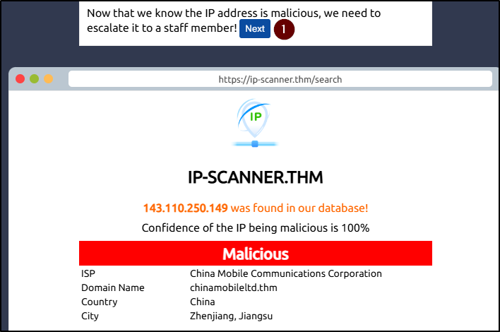
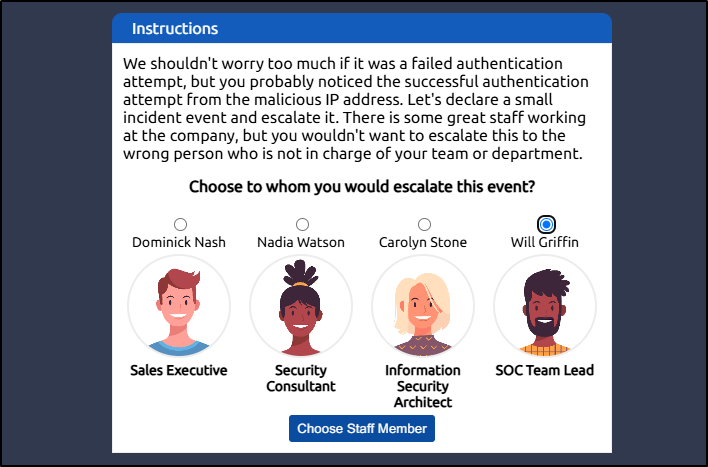
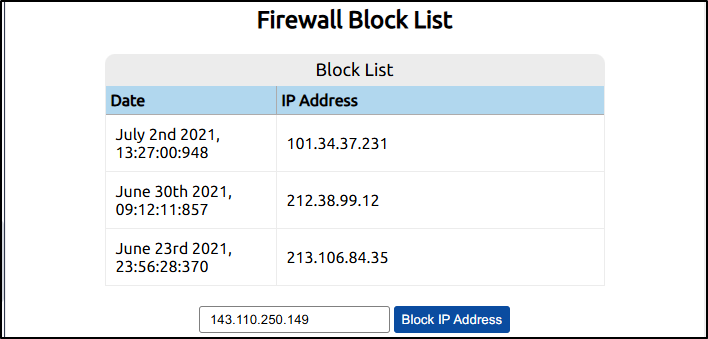

##### Link: [Defensive Security Intro](https://tryhackme.com/room/defensivesecurityintro)
---
##### Task 1: Introduction to Defensive Security
1. Which team focuses on defensive security?
	- `Blue Team`
---
##### Task 2: Areas of Defensive Security
1. What would you call a team of cyber security professionals that monitors a network and its systems for malicious events?
	- `Security Operations Center`
2. What does DFIR stand for?
	- `Digital Forensics and Incident Response`
3. Which kind of malware requires the user to pay money to regain access to their files?
	- `ransomware`
---
##### Task 3: Practical Example of Defensive Security
1. What is the flag that you obtained by following along?
	- Find malicious IP
		- 
	- Run scanner on it
		- 
	- IP is confirmed as malicious, click `Next`
		- 
	- Report to SOC Team Lead
		- 
	- Block malicious IP 
		- 
	- Obtain flag
		- 
	- ------------
	- Flag: `THM{THREAT-BLOCKED}`
---
