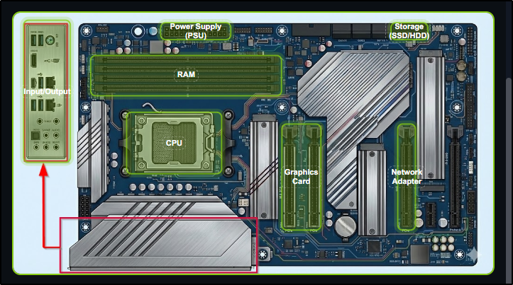

##### Link: [Inside a Computer System](https://tryhackme.com/room/insideacomputer)
---
##### Task 1: Introduction
1. Let's get started!
	- `No answer needed`
---
##### Task 2: Introduction
1. Give in the flag you received after completing the exercise on the static site.
	1. Section 1 - Components
		1. Motherboard
			1. What role does the motherboard play in a computer?
				- `It connects and allows communication between all components`
		2. CPU
			1. What do you think the CPU does?
				- `Executes instructions and performs calculations`
		3. RAM
			1. How would you describe what RAM does?
				- `Stores data temporarily while the computer is running`
		4. Storage
			1. What's the main purpose of storage devices like SSDs and HDDs?
				- `To save data permanently even when powered off`
		5. Network Adapter
			1. What does a network adapter enable a computer to do?
				- `Communicate with other computers and networks`
		6. PSU
			1. What is the main function of the Power Supply Unit?
				- `To supply electrical power to all components`
		7. Graphic Card
			1. What does a graphics card primarily handle?
				- `Processing and outputting visual information to displays`
		8. Input/output
			1. What are input and output devices used for?
				- `To send data to and receive data from the computer`
	2. Section 2: Inspection
		1. Drag the components to its place
			- 
	- ------------
	- Flag: `THM{4llpccomp0n3nts1d3nt1f13d}`
---
##### Task 3: What Happens When You Press the Start Button?
1. What is the flag that you received after completing the exercise?
	1. Animation
		1. What happens first when you press the power button?
			- `The PSU starts delivering power to components`
		2. What is UEFI's role in the boot process?
			- `It initializes and coordinates hardware components`
		3. What does POST check for?
			- `Whether required hardware is present and working`
		4. How does UEFI know which device to boot from?
			- `It follows a configured boot priority list`
		5. What does the bootloader do?
			- `Loads the operating system into RAM`
	2. Drag & drop 
		1. Press power button
		2. Firmware starts
		3. POST
		4. Select boot device
		5. Initiate bootloader
	- ------------
	- Flag: `THM{pc5ucce55fully5t4rt3d}`
---
##### Task 4: Conclusion
1. I am ready to discover the different types of computer systems and their function!
	- `No answer needed`
---
