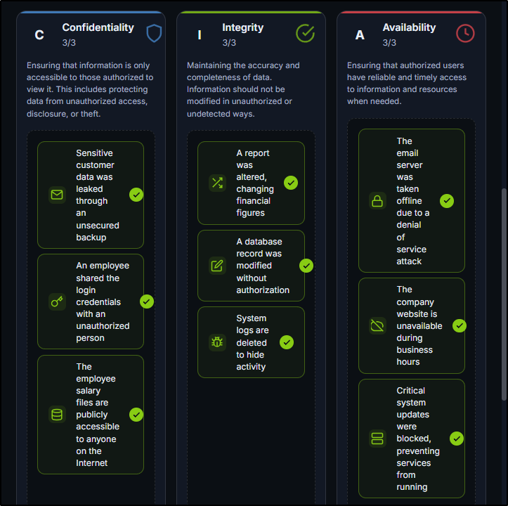

##### [The CIA Triad](https://tryhackme.com/room/theciatriad)
---
##### Task 1: Introduction
1. I am ready to start!
	- `No answer needed`
---
##### Task 2: Understanding the CIA Triad
1. Which pillar of the CIA focuses on preventing unauthorized modification of data?
	- `Integrity`
2. Which pillar of the CIA focuses on preventing unauthorized access to data?
	- `Confidentiality`
3. Which CIA pillar ensures data is available to users when needed?
	- `Availability`
4. Which CIA pillar gets impacted if the data becomes untrustworthy?
	- `Integrity`
5. What is the term used collectively for all these pillars?
	- `CIA Triad`
---
##### Task 3: The Security Mindset
1. What is the flag received after solving the exercise?
	- 
	- `THM{CIA_IS_ABOUT_BALANCE}`
2. CIA Triad is not just a set of definitions; it's a mindset. What type of mindset is it?
	- `Security mindset`
---
##### Task 4: Conclusion
1. Complete this room.
	- `No answer needed`
---
