##### Link: [Windows Basics](https://tryhackme.com/room/windowsbasics)
---
##### Task 1: Introduction
1. I understand the learning objectives and am ready to learn about Windows!
	- `No answer needed`
---
##### Task 2: Exploring the Windows Workspace
1. After opening `About your PC`, navigate to the `Device specifications` section. What is the `Device name` specified?
	-   Image:
		- 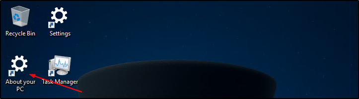
		- 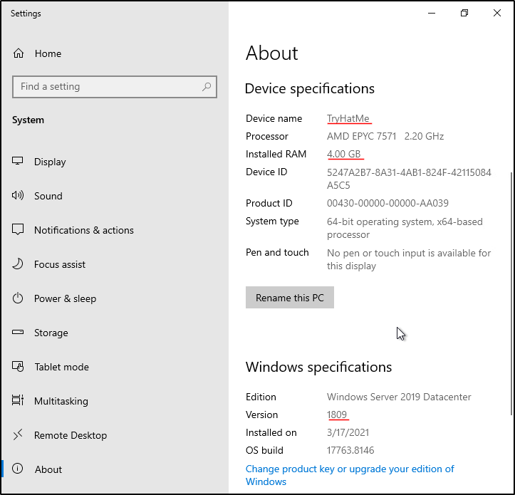
	- `TryHatMe`
2. Continue looking through the `Device specifications`. How much RAM is installed on your new work PC?
	- `4.00 GB`
3. Scroll down to the `Windows specifications` section. Which `Version` of Windows Server 2019 Datacenter is installed?
	- `1809`
4. Explore the `TryHatMe Onboarding` folder located on your computer's Desktop. What is the flag value found within `Welcome.txt`?
	- Image:
		- 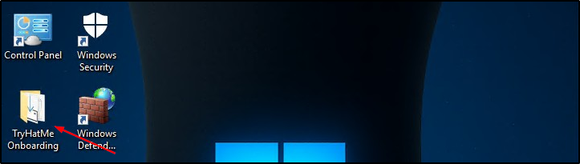
		- 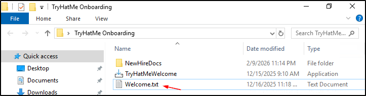
		- 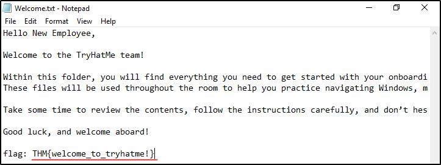
	- `THM{welcome_to_tryhatme!}`
---
##### Task 3: Configuring and Securing Windows
1. Use the `TryHatMeWelcome` installer located within the `TryHatMe Onboarding` folder. What is the flag value you receive after installing and running the application?
	- Run installer, click `Next -> next -> Install -> Finish` 
		- 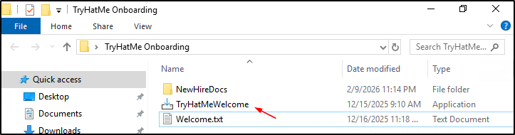
		- 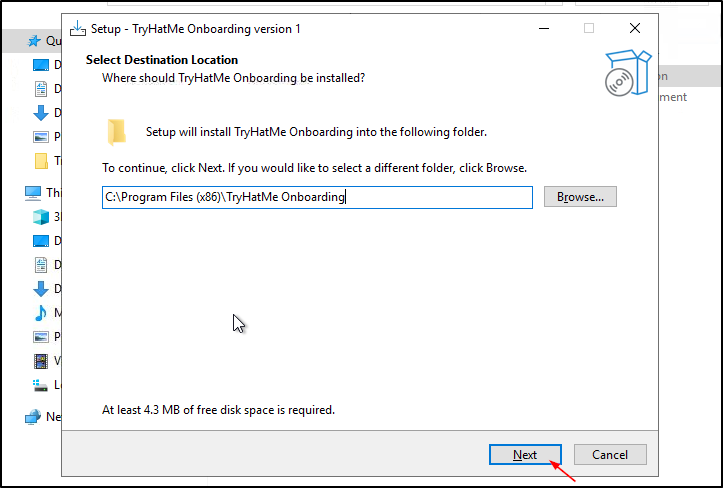
		- 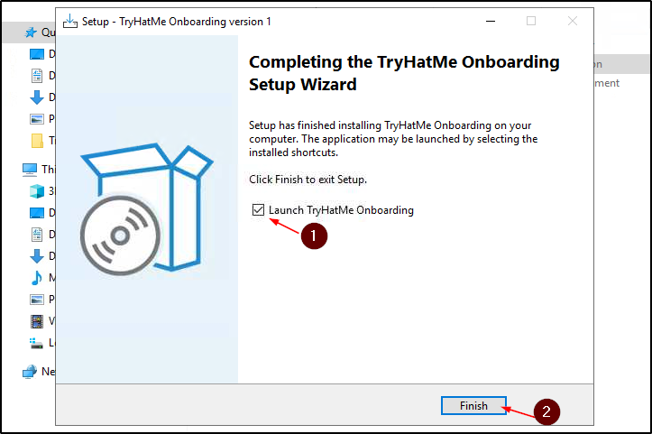
		- 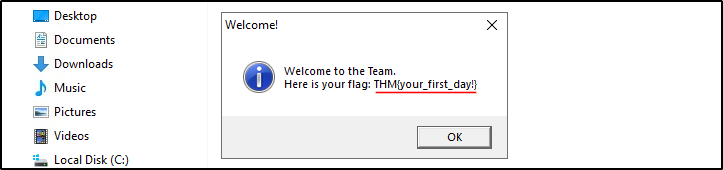
	- `THM{your_first_day!}`
2. Investigate the `Time & Language`section of the `Windows Settings` app. Which country or region is your computer currently set to?
	- Image:
		- 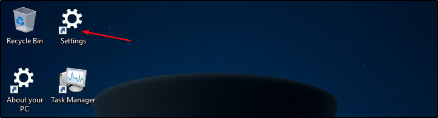
		- 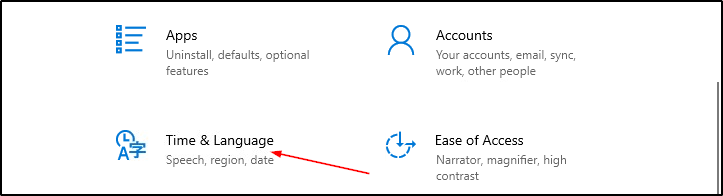
		- 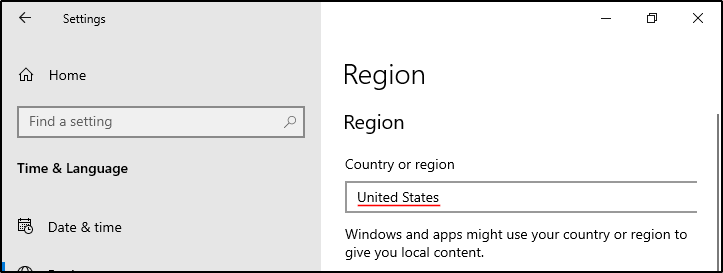
	- `United States`
3. Open the `Task Manager` on your workstation's Desktop and navigate to the `Users` tab. Which account is currently logged in?
	- Image:
		- 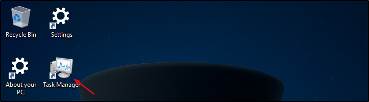
		- 
	- `Administrator`
4. After performing your custom scan, click `Virus:DOS/EICAR_Test_File` and select `See details`. What is the file name shown in the `Affected items` section?
	- Image:
		- 
		- 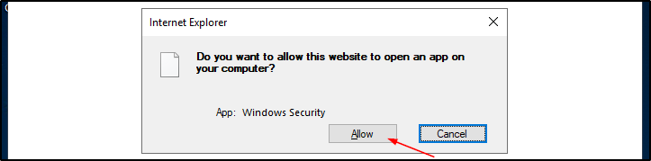
		- 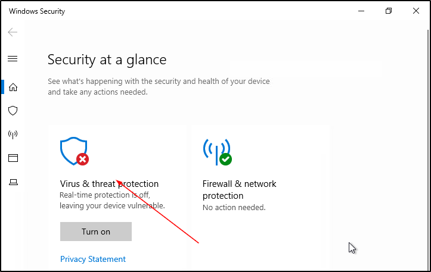
		- 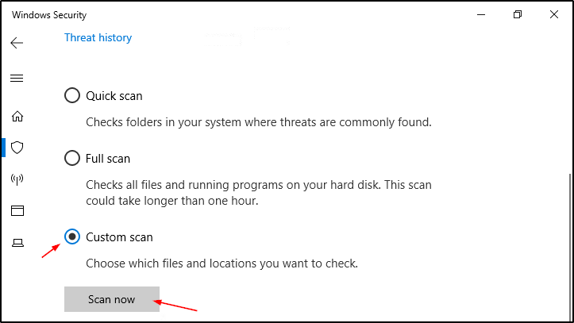
		- 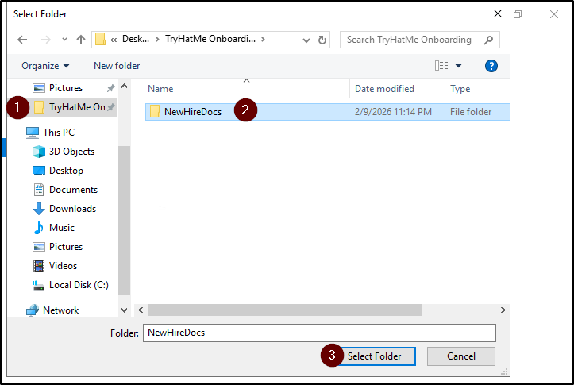
		- 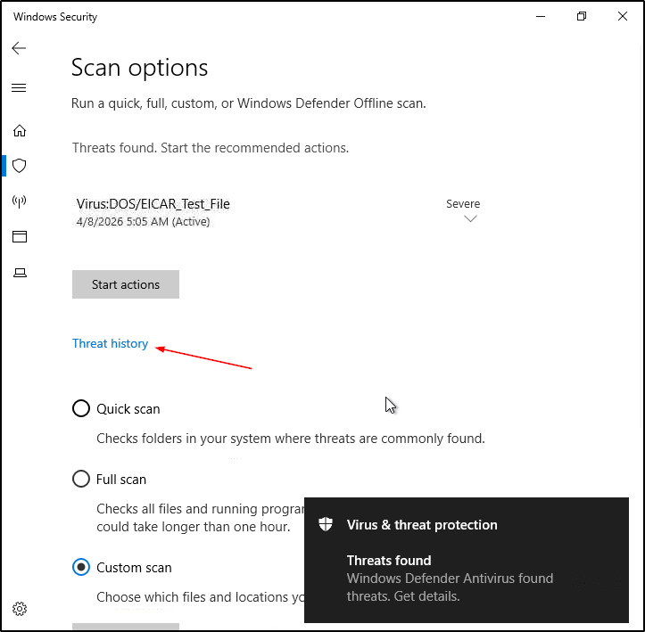
		- 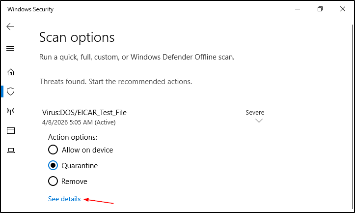
		- 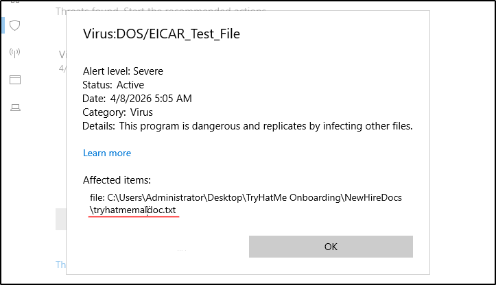
	- Note: Sometimes Windows automatically quarantine the file before scan even started. In that case you can go to `Threat history -> Quarantined threats -> See details`  
	- `tryhatmemaldoc.txt`
---
##### Task 4: Conclusion
1. Complete the room and continue on your cyber learning journey!
	- `No answer needed`
---
